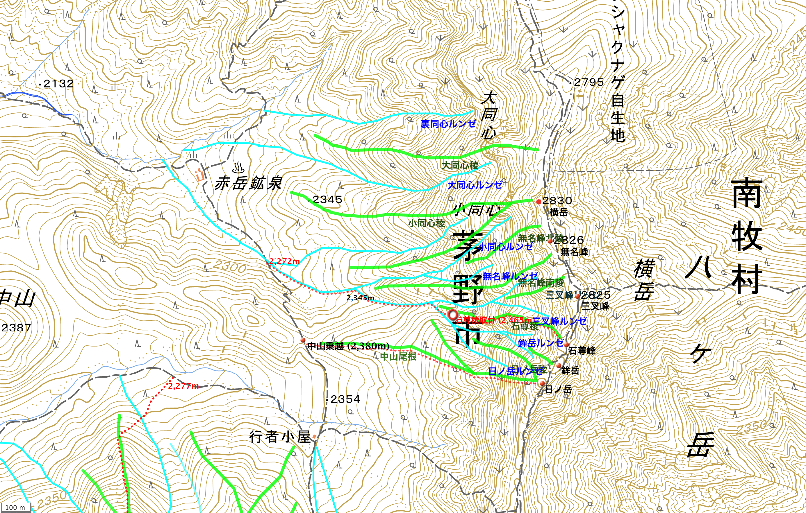
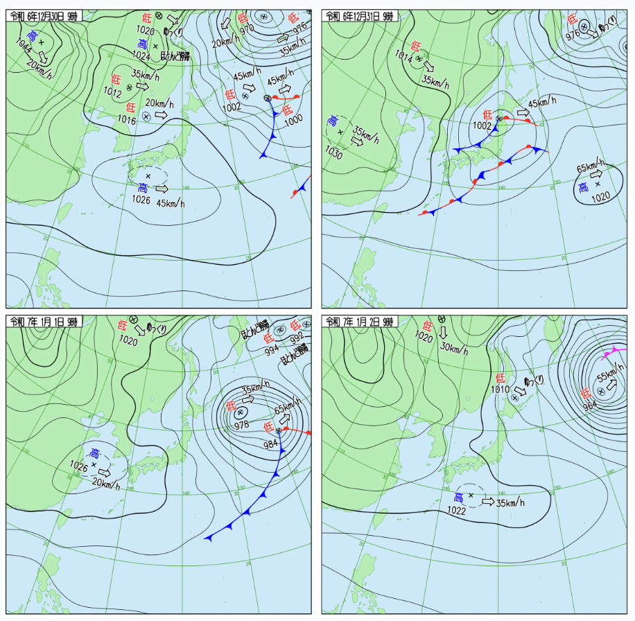
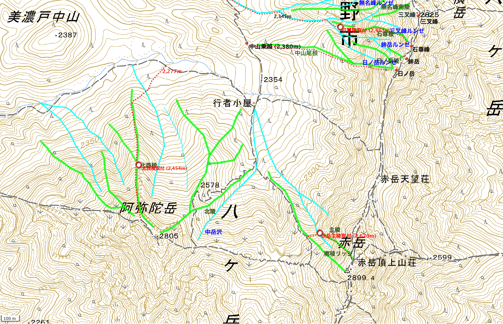
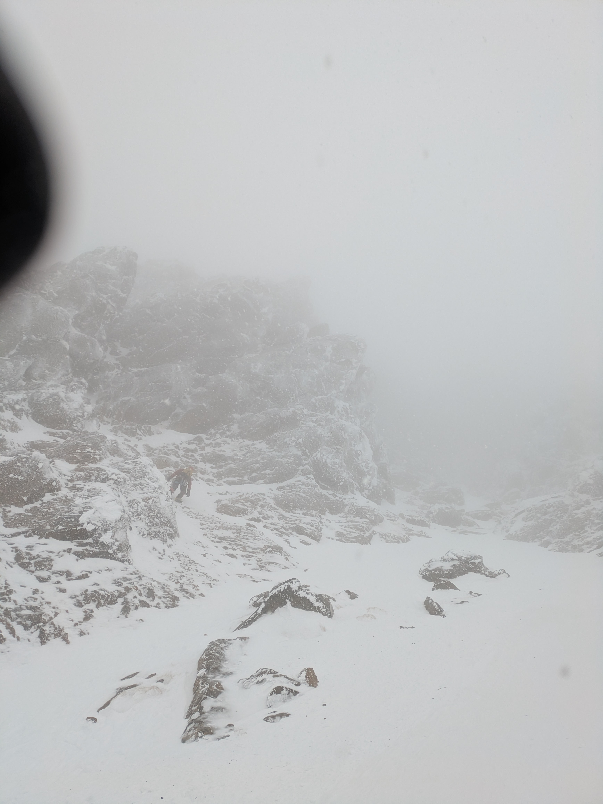
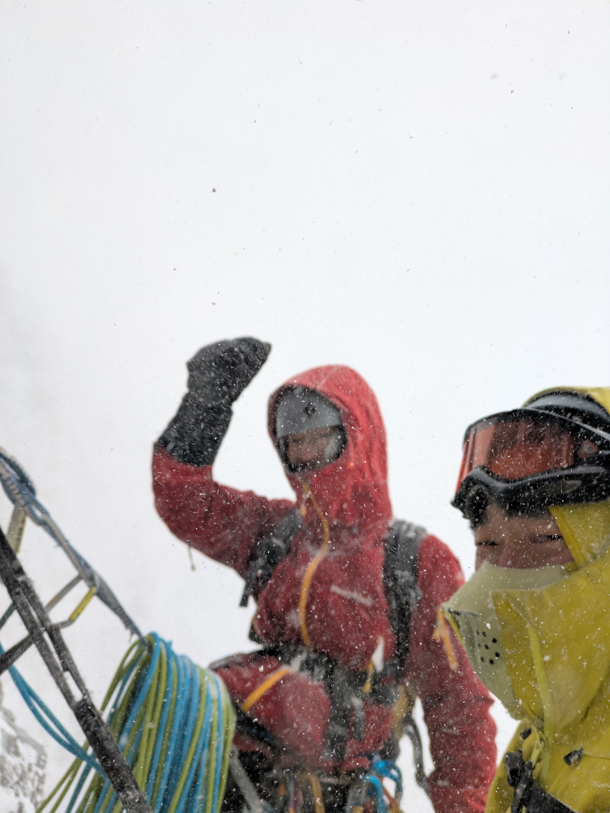
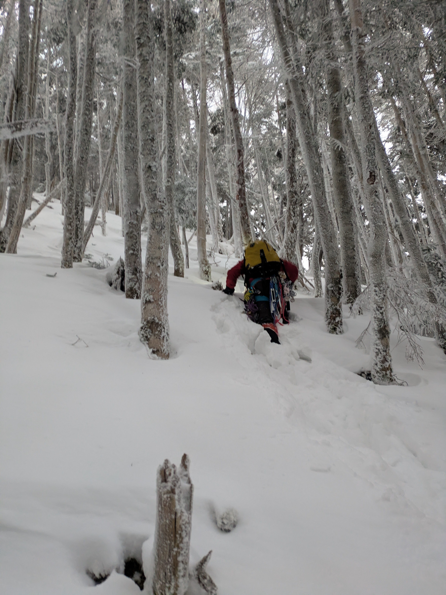

December 29,2024 - January 2, 2025

<h1 style="text-align: center;">八ヶ岳冬季登攀 — 中山尾根・阿弥陀北西稜  </h1>

* 年末年始に八ヶ岳で冬壁入門。

* 大学時代に行者小屋ベースで約1週間の缶詰を経験している、思い出深い
* 今回はそれから約7年後、冬壁のほぼ全てを忘れているがふと行きたくなり計画
* パートナーは4年前に知り合った通称KAS、年末年始休暇をほぼ全振りして挑んだ
* 結局大学時代と変わらずお金はなくフリーズドライで軽量化なんかできず、進歩しない食料計画もあり入山は30kgオーバー、アプローチにアホほど時間がかかる

## 工程

| 日付       | 概要                     | 工程                                                         |
| :--------- | ------------------------ | ------------------------------------------------------------ |
| 2024/12/29 | アプローチ               | 8:00 八ヶ岳山荘→12:30 行者小屋 BC設営→アプローチ偵察         |
| 2024/12/30 | 中山尾根                 | 6:20 出発→6:35 中山乗越→7:30 取付【登攀開始】→13:20 日ノ岳【登攀終了】→16:15 行者小屋BC |
| 2024/12/31 | 赤岳主稜                 | 9:30 出発→10:20 取付【登攀開始】→12:40 取付（敗退）【登攀終了】 →14:00 行者小屋BC |
| 2025/1/1   | 阿弥陀北西稜             | 6:15 出発→7:10 北西稜尾根→8:50 下部岩壁【登攀開始】→11:00 上部岩壁→13:00 阿弥陀岳【登攀終了】→14:00 行者小屋BC |
| 2025/1/2   | 赤岳鉱泉アイスキャンディ | 9:30 BC撤収・出発→ 10:00 赤岳鉱泉アイスキャンディ→19:30 八ヶ岳山荘 |

<!-- 天気図  -->

## 山域概要

### 横岳周辺

### 赤岳・阿弥陀岳周辺

## 2024/12/30 中山尾根

快晴。アプローチは中山乗越、看板あり。取付きは明瞭。 下部岩壁出だしのルート取りに迷い、個人的にはここが核心。

1P終了点から見下ろす下部岩壁基部

## 2024/12/31 赤岳主稜　敗退

寒気が舞い込み塩カルサイズ雪が横風に乗り顔を叩きつける。視界不良で取付きのチョックストーンを見つけるのに30分以上ロスした。 取付き到着して、とりあえず1p登ってみることに。まともに目を開けていられず、ホールドを探す、中間視点作り等々全てが困難だった。1p目終了後、懸垂下降で取付きまで下降。撤退することにした。

赤岳主稜取付のチョックストーンへ向かう

1p終了後懸垂下降でチョックストーン取付まで戻る、敗退

## 2025/1/1 阿弥陀北西稜

快晴。前日の雪でトレースは消えていた。30cm程度は積もったのだろう。樹林帯から稜線歩き、岩壁登攀という、山全体を遊べる感じが気持ち良い。 核心はカムで人工登攀と思っていたが、人工ボルトが２、3点程打ってあり、思っていたほどストレスなく抜けられた。 ここをフリーで抜ける人はすごいな...。

中山尾根からの阿弥陀岳。右上に見える馬の背中のような尾根が北西稜

アプローチ樹林帯。この日は膝〜腰ラッセル。わかんは不要だった。

樹林帯アプローチの様子

阿弥陀北西稜 下部＆上部岩壁。正面がフェースルート、正面右寄の割れ目がクラックルート。

下部岩壁。中間視点が雪で埋もれて発見できずリードはフリーで登る

上部岩壁：フェースは一眼見てで無理即断、クラックへ。

上部岩壁を抜けフリー箇所。意外と悪く少し緊張する

